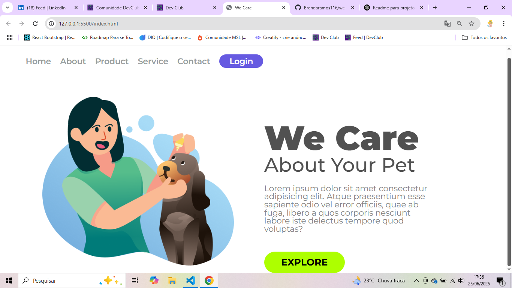

# We Care 🐾

Um projeto de página inicial simples e elegante, feito com **HTML** e **CSS**, focado em pets. O objetivo é apresentar um layout moderno com navegação básica e um design visualmente atrativo.

## 🖼️ Visão Geral

A landing page apresenta:

- Um cabeçalho com links de navegação e botão de login.
- Uma imagem representativa de uma mulher com um cachorro.
- Um título, subtítulo, parágrafo descritivo e botão de ação.

## 🔧 Tecnologias Utilizadas

- **HTML5**
- **CSS3**
- **Google Fonts** (Montserrat)

## 📁 Estrutura do Projeto

we-care/
├── index.html
├── styles.css
└── img/
└── Illustration 2.png


## 💡 Funcionalidades

- Design responsivo básico.
- Navegação visualmente organizada.
- Tipografia moderna com a fonte Montserrat.
- Layout com imagem e texto alinhados lado a lado.

## 🖌️ Estilo

- Cores principais: roxo (#665AE1), verde-limão (#ADFF00), cinza (#515151, #848484).
- Layout limpo e espaçado, com foco na legibilidade e visual atrativo.
- Botões com cantos arredondados e cores de destaque.

## 🚀 Como Usar

1. Clone o repositório:
   ```bash
   git clone https://github.com/seu-usuario/we-care.git
Abra o arquivo index.html no navegador para visualizar a página.

✨ Pré-visualização



Feito com 💜 por [Brenda da Conceição Ramos]
